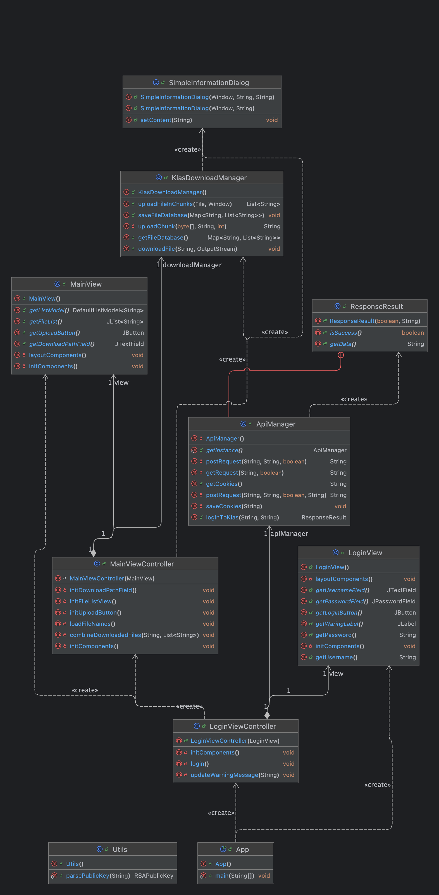
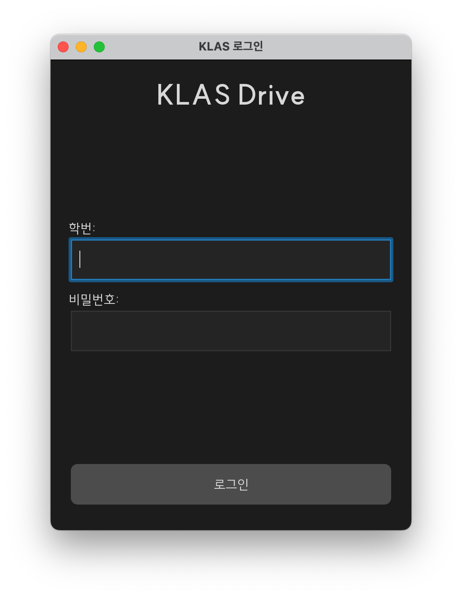
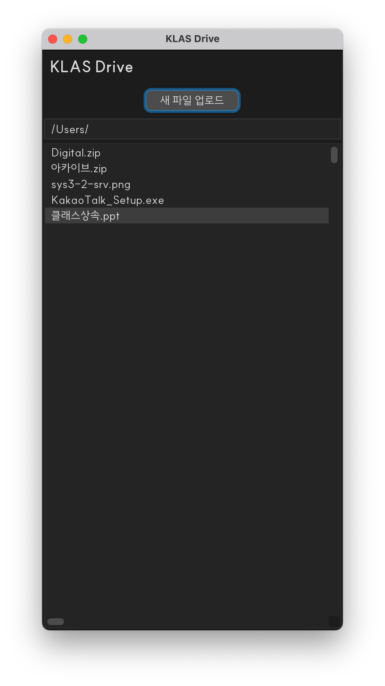

## KLAS Drive

  

### 개요
**KLAS Drive**는 마치 Google Drive처럼 KLAS에 파일을 업로드하고 다운로드할 수 있도록 하는 Java 애플리케이션입니다. 이 프로그램은 광운대학교의 공식 소프트웨어가 아니며, 사용에 대한 모든 책임은 사용자에게 있음을 알려드립니다. 또한, KLAS 서버에 과부하가 가지 않도록 병렬 업로드 및 다운로드 기능은 일부러 구현하지 않았습니다. UI는 Swing 프레임워크로 만들어졌습니다.  
**KLAS가 주기적으로 파일을 정리하는 것으로 보입니다. 데이터가 언제든 유실될 수 있습니다!!**

### 스크린샷
   

### 주요 기능
- **로그인**: 학번과 비밀번호로 쉽게 로그인할 수 있습니다.
- **파일 업로드**: 간편하게 파일을 KLAS에 업로드할 수 있습니다.
- **파일 다운로드**: 필요한 파일을 KLAS에서 다운로드할 수 있습니다.
- **단일 스레드 작업**: KLAS 서버에 과부하를 주지 않도록 병렬 처리를 하지 않습니다.

### 준비물
- Java Development Kit (JDK)
- KLAS 계정

### 사용 방법
1. **로그인 화면**:
    - "학번" 칸에 학번을 입력해 주세요.
    - "비밀번호" 칸에 비밀번호를 입력해 주세요.
    - "로그인" 버튼을 눌러서 메인 화면으로 이동합니다.

2. **메인 화면**:
    - **파일 업로드**: "새 파일 업로드" 버튼을 클릭하여 파일을 선택하고 업로드합니다.
    - **파일 다운로드**: 파일 목록에서 다운로드할 파일을 더블 클릭하여 지정한 경로에 저장합니다.
    - **다운로드 경로 설정**: 하단의 텍스트 필드에 원하는 다운로드 경로를 입력합니다.
    - **파일 삭제**: 목록에서 파일을 우클릭하면 제거할 수 있습니다.

### 코드 구조
- **App.java**: 애플리케이션의 시작점으로, UI 테마를 설정하고 로그인 화면을 시작합니다.
- **LoginView.java**: 로그인 UI를 정의합니다.
- **MainView.java**: 로그인 후 메인 UI를 정의합니다.
- **LoginViewController.java**: 로그인 처리를 담당합니다.
- **MainViewController.java**: 파일 업로드 및 다운로드를 포함한 메인 UI 처리를 담당합니다.
- **KlasDownloadManager.java**: 파일을 청크 단위로 업로드하고 다운로드하는 메서드를 포함하고 있습니다.
- **ApiManager.java**: API 요청 및 응답을 처리하며, 로그인 인증을 포함합니다.

### 중요 사항
- KLAS 서버에 부하를 주지 않기 위해 병렬 업로드 및 다운로드를 지원하지 않습니다.
- UI는 Swing 프레임워크를 사용하여 구성되었습니다.
- 이 소프트웨어의 사용에 따른 모든 책임은 사용자에게 있습니다.
- **KLAS가 주기적으로 파일을 정리하는 것으로 보입니다. 데이터가 언제든 유실될 수 있습니다!!**

### 라이선스
이 프로젝트는 MIT 라이선스 하에 제공됩니다.

### Disclaimer
이 소프트웨어는 광운대학교와 아무런 관련이 없으며, 승인받지 않았습니다. 이 소프트웨어의 사용은 전적으로 사용자의 책임입니다. 개발자는 이 소프트웨어의 오용이나 그로 인해 발생할 수 있는 손해에 대해 책임을 지지 않습니다.

### 기여  
이 프로젝트는 **모든 기여를 적극적으로 환영합니다.** 기여 방식에는 아무런 규칙이 없으니 부담없이 기여해주세요!